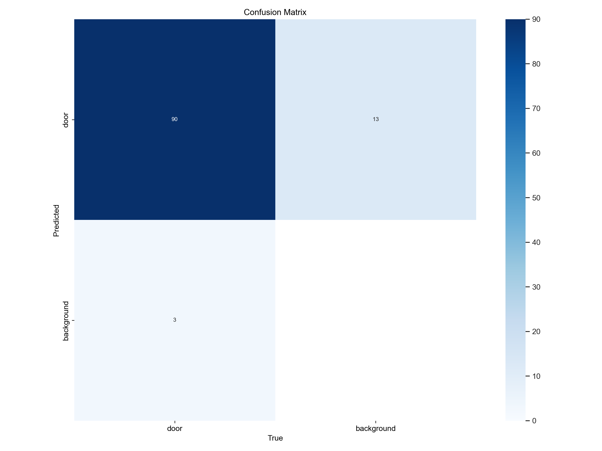
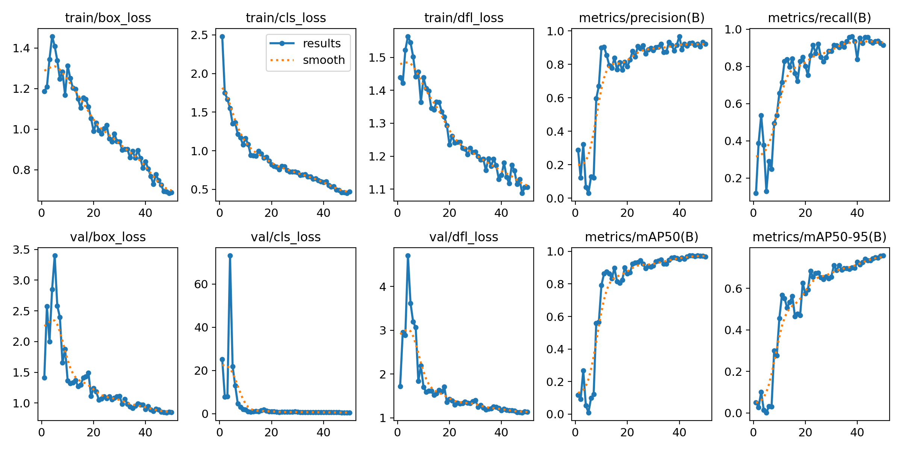

# AURA
Autonomous Unified Routing and Analysis


https://github.com/user-attachments/assets/7f360d72-43e6-4dbd-950c-81bd507abf28


# SLAM
## Environment Setup and Running
Follow the instructions linked in this github repository **https://github.com/jahaniam/orbslam3_docker**
Once the container is running, pull the ORB-SLAM3 folder into the container
In order to get the dataset into the container, run ```docker cp .\Custom\ <container_id>:/Datasets/EuRoC```
Then, to run SLAM on the dataset, cd into ORB_SLAM3/Examples and run ```bash euroc_examples.sh```
## Dataset Creation
### Dependencies
#### Pillow
python3 -m pip install --upgrade Pillow

#### Opencv
pip install opencv-python

In order to create a dataset with a standard mp4 video. Run the following command
```./dataset_creator.py <timestamp_start> <timestamp_end>```
where timestamp_start is an arbitrary start time, and timestamp_end is timestamp_start plus the video length in nanoseconds

## Fixing Trajectory
The trajectory txt file that ORB-SLAM3 outputs needs to be adjusted such that the timestamps are adjusted to a center of 1000000000500000000 and then converted to frames. This allows it to operate with visualize.py and plot the trajectory and doors accurately. Useage is as follows.
```./fix_trajectory.py <input.txt> <output.txt>```

## Visualize
After updating the trajectory file, it can be visualized alongside the detection file that YOLO outputs. Useage for the visualizer is as follows.
```./visualize.py <trajectory.txt> <yolo.txt>```


# AURA.py - YOLO
`AURA.py` is a script that screen records the video from the Duckiebot DTS GUI, saves the recorded video as `recording.mp4`, then runs YOLO to detect doors and saves an annotated video as `yolo_annotations.mp4` an saves the IDs of each door and its bounding boxes detected in each from in `yolo_output.txt`. `recording.mp4` can then be used for the SLAM algorithm, and `yolo_output.txt` can be used to visualize the doors on the slam generated outputs.

To Run:
```
python3 AURA.py
```

## Requirements
```
pip install -r requirements.txt
```

When installing [PyTorch](https://link-url-here.org) make sure to make sure you install it with CUDA so YOLO can run.


## YOLO
`AURA.py` utilizes YOLOv8 to run image detection and detect doors on our video. This is done using the Ultralytics python package.

### Training
The dataset we used consists of images of walls and doors from Kemper Hall.
- Link to Dataset: [KemperDataset](https://drive.google.com/drive/folders/1596j4mNN_Z476sYonWvuGMJGITzvpEpl?usp=sharing).

- This dataset was labelled using [cvat](https://www.cvat.ai/).
- This dataset was created using [roboflow](https://app.roboflow.com/).

Ultralytics utilizes a .yaml file to specify the locations of the dataset and what augmentations to use. The augmentations we decided to use were:
- scale
- translate
- perspective
- fliplr
- mixup

To train YOLO run the `DoorDetector/TrainDetector.ipynb` file.

#### Training Results



